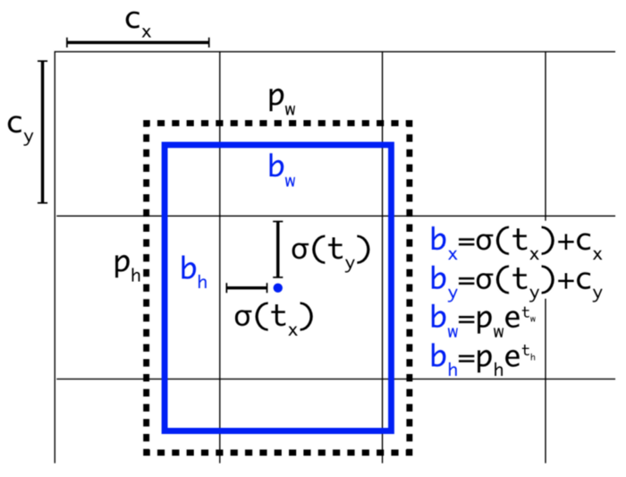
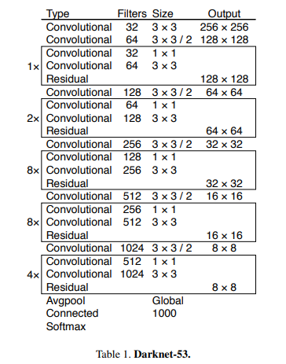
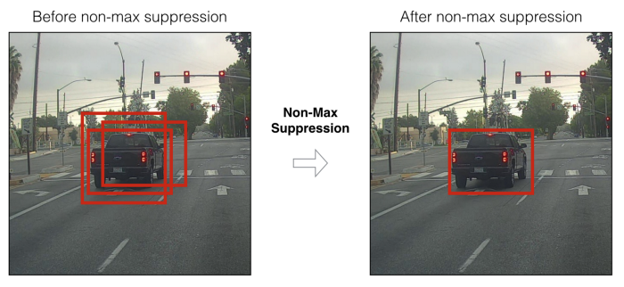
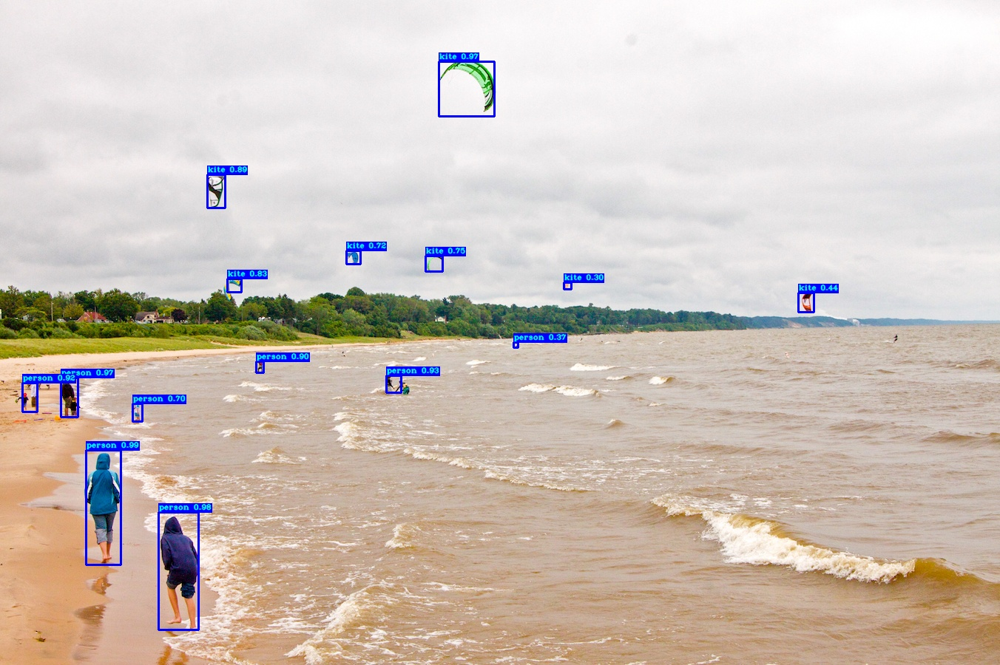

## YoloV3 Scratch Implementation in Tensorflow 2

**Simple implementation of Yolov3 given in this https://pjreddie.com/media/files/papers/YOLOv3.pdf paper in TF 2 for understanding**

The output of the three branches of the YOLOv3 network will be sent to the decode function to decode the channel information of the Feature Map. In the following picture: the black dotted box represents the a priori box (anchor), and the blue box represents the prediction box. The dimensions of the bounding box are predicted by applying a log-space transformation to the output and then multiplying with an anchor:

* b denote the length and width of the prediction frame respectively, and
  P denote the length and width of the a priori frame respectively.
* t represents the offset of the center of the object from the upper left corner of the grid, and C represents the coordinates of the upper left corner of the grid.




## NMS processing
Non-Maximum Suppression, as the name implies, suppresses elements that are not maximal. NMS removes those bounding boxes that have a higher overlap rate and a lower score. The algorithm of NMS is straightforward, and the iterative process is as follows:
* Process 1: Determine whether the number of bounding boxes is greater than 0, if not, then end the iteration;
* Process 2: Select the bounding box A with the highest score according to the score order and remove it;
* Process 3: Calculate the IoU of this bounding box A and all remaining bounding boxes and remove those bounding boxes whose IoU value is higher than the threshold, repeat the above steps.



#### Files Details
**Run the Demo**

Download the yolov3 weights from https://pjreddie.com/media/files/yolov3.weights and place in `models/yolov3.weights`
* ALL the core yolov3 implementation are found inside /yolov3 directory.
   * Or you can download weights by simply running
   ```shell 
      python download_weights.py
    ```
  This will download yolov3.weights inside models diretory.
* Change the configuration inside yolov3/config.py
```shell
python detection_demo.py
```


